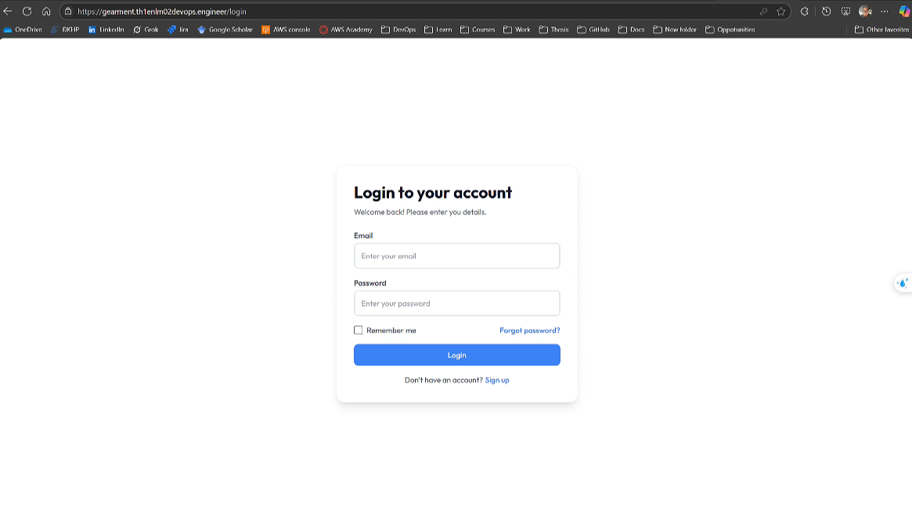

## Overview
This project deploys a web application on AWS, featuring a React front-end, Node.js back-end, and MongoDB database, all containerized with Docker. Infrastructure is provisioned via Terraform, with Nginx as a reverse proxy, automated MongoDB backups to S3, and CI/CD pipelines using GitHub Actions. This README provides a clear deployment guide for the project, hosted across three repositories in the [gearment-th1enlm02](https://github.com/gearment-th1enlm02) organization:

- [gearment-terraform](https://github.com/gearment-th1enlm02/gearment-terraform): AWS infrastructure setup.
- [gearment-hello-world-ui](https://github.com/gearment-th1enlm02/gearment-hello-world-ui): Front-end application.
- [gearment-hello-world-app](https://github.com/gearment-th1enlm02/gearment-hello-world-app): Back-end API.

## Architecture
### Infrastructure
- **EC2 Instance**:
  - Type: t2.micro
  - OS: Ubuntu 22.04
  - Private IP: `10.0.1.10`
  - EBS: 8GB
  - Hosts: Docker containers, Nginx
- **S3 Buckets**:
  - `gearment-app-user-avatars-bucket`: User avatars
  - `gearment-app-db-backups-bucket`: MongoDB backups
- **IAM**:
  - Users: `gearment-app-avatar-user`, `gearment-app-backup-user`
  - Permissions: `PutObject`, `GetObject`, `DeleteObject`, `ListBucket` for respective buckets
- **Security Group**:
  - Inbound: HTTP (80), HTTPS (443), SSH (22)
  - Outbound: All traffic
- **VPC**:
  - CIDR: `10.0.0.0/16`
  - Public Subnet: `10.0.1.0/24`
  - Components: Internet Gateway, Route Table, Gateway Endpoint for S3 (routes S3 traffic internally within AWS)
- **Repository**: [gearment-terraform](https://github.com/gearment-th1enlm02/gearment-terraform)

<p align="center">
  
</p>

### Application
- **Back-end**:
  - Node.js API, connects to MongoDB
  - Dockerized, port 5001
  - Repository: [gearment-hello-world-app](https://github.com/gearment-th1enlm02/gearment-hello-world-app)
- **Front-end**:
  - React application
  - Dockerized, port 3000
  - Repository: [gearment-hello-world-ui](https://github.com/gearment-th1enlm02/gearment-hello-world-ui)
- **MongoDB**:
  - Container: `app-mongo-1`
  - Port: `27017` (container)
  - Auth: `gearment-admin`/`gearment-admin`

### Nginx
- Reverse proxy on port 80:
  - `gearment.th1enlm02devops.engineer`: Proxies to `localhost:3000` (front-end)
  - `gearment-api.th1enlm02devops.engineer`: Proxies to `localhost:5001` (back-end)
- Config File:
  - [`/etc/nginx/sites-available/gearment`](https://github.com/gearment-th1enlm02/gearment-terraform/blob/main/templates/fe-nginx.conf)
  - [`/etc/nginx/sites-available/gearment-api`](https://github.com/gearment-th1enlm02/gearment-terraform/blob/main/templates/be-nginx.conf)

### Backup
- MongoDB backups to `gearment-app-db-backups-bucket`
- Script: `/usr/local/bin/mongo_backup.sh`
- Schedule: Daily at 02:00 AM VN (19:00 UTC)
- Output: `.tar.gz` files

### CI/CD
- GitHub Actions: Builds Docker images, pushes to Docker Hub, deploys to EC2
- Config: `.github/workflows/main.yml` in app repositories

<br/>

<p align="center">
  
</p>

## Deployment Instructions

### Phase 1: Automated Infrastructure Setup
This phase provisions AWS infrastructure using Terraform and automatically installs necessary tools on the EC2 instance via a user data script ([init.sh](https://github.com/gearment-th1enlm02/gearment-terraform/blob/main/scripts/init.sh)).

#### Prerequisites
- AWS account with programmatic access (Access Key and Secret Key).
- Terraform installed locally.
- SSH key pair (`<your-keypair>.pem`).
- Access to GitHub repositories: [gearment-terraform](https://github.com/gearment-th1enlm02/gearment-terraform), [gearment-hello-world-ui](https://github.com/gearment-th1enlm02/gearment-hello-world-ui), [gearment-hello-world-app](https://github.com/gearment-th1enlm02/gearment-hello-world-app).

#### Steps
1. **Install AWS CLI**:
   - Download and install AWS CLI (v2) on your local machine:
     ```bash
     curl "https://awscli.amazonaws.com/awscli-exe-linux-x86_64.zip" -o "awscliv2.zip"
     unzip awscliv2.zip
     sudo ./aws/install
     ```
   - Verify installation:
     ```bash
     aws --version
     ```

2. **Configure AWS Credentials**:
   - Create or edit the credentials file at `~/.aws/credentials`:
     ```bash
     mkdir -p ~/.aws
     nano ~/.aws/credentials
     ```
   - Add credentials (use `default` profile or any custom profile):
     ```ini
     [default]
     aws_access_key_id = <your-access-key>
     aws_secret_access_key = <your-secret-key>
     ```
   - Set region in `~/.aws/config`:
     ```bash
     nano ~/.aws/config
     ```
     ```ini
     [default]
     region = ap-southeast-1
     ```

3. **Clone Terraform Repository**:
   ```bash
   git clone https://github.com/gearment-th1enlm02/gearment-terraform.git
   cd gearment-terraform
   ```

4. **Configure Terraform Variables**:
   - Copy the example variables file:
     ```bash
     cp terraform.tfvars.example terraform.tfvars
     ```
   - Edit `terraform.tfvars` to match your context:
     ```bash
     nano terraform.tfvars
     ```
     - Update `aws_region`, `aws_project`, `aws_owner`, `aws_keyname`, etc. Refer to `terraform.tfvars.example` for structure.

5. **Set Up Terraform Cloud Backend**:
   - Ensure `terraform.tf` includes the Terraform Cloud backend:
     ```hcl
     terraform {
       cloud {
         organization = "gearment-th1enlm02"
         workspaces {
           name = "gearment"
         }
       }
       required_providers {
         aws = {
           source  = "hashicorp/aws"
           version = "5.70.0"
         }
         tls = {
           source  = "hashicorp/tls"
           version = "4.0.6"
         }
         http = {
           source  = "hashicorp/http"
           version = "3.4.5"
         }
         local = {
           source  = "hashicorp/local"
           version = "2.5.2"
         }
       }
       required_version = ">= 1.2.0"
     }
     ```
   - Log in to Terraform Cloud:
     ```bash
     terraform login
     ```
     - Generate a token at `https://app.terraform.io/app/settings/tokens`.
   - Initialize the workspace:
     ```bash
     terraform init
     ```

6. **Initialize and Apply Terraform**:
   ```bash
   terraform plan
   terraform apply --auto-approve
   ```
   - This provisions:
     - EC2 instance (t2.micro, Ubuntu 22.04, private IP `10.0.1.10`).
     - S3 buckets (`gearment-app-user-avatars-bucket`, `gearment-app-db-backups-bucket`).
     - IAM users (`gearment-app-avatar-user`, `gearment-app-backup-user`).
     - VPC, Security Group, Route Table, and Gateway Endpoint for S3 (routes traffic to S3 buckets internally within AWS).
   - Note: For your setup, use your own bucket names in the endpoint policy.

7. **Retrieve S3 Access Keys**:
   - Export IAM user access keys to a JSON file:
     ```bash
     terraform output -json s3_access_keys > s3_access_keys.json
     ```
   - Example output (do not use these keys):
     ```json
     {
       "gearment-app-avatar-user": {
         "access_key_id": "AKIAEXAMPLE1234567890",
         "secret_access_key": "secretkeyexample1234567890abcdef"
       },
       "gearment-app-backup-user": {
         "access_key_id": "AKIAEXAMPLE0987654321",
         "secret_access_key": "secretkeyexample0987654321xyz"
       }
     }
     ```
   - Save these keys for use in the backup script and back-end environment variables.

8. **Map Domains to EC2 Public IP**:
   - Log in to your Cloudflare account (or other DNS provider).
   - Add A records for:
     - `gearment.th1enlm02devops.engineer` -> `<ec2-public-ip>`
     - `gearment-api.th1enlm02devops.engineer` -> `<ec2-public-ip>`
     - Note: Replace with your own domains if using a different context.
   - Verify DNS propagation:
     ```bash
     dig gearment.th1enlm02devops.engineer
     dig gearment-api.th1enlm02devops.engineer
     ```

9. **Automated Tool Installation**:
   - The EC2 instance runs [init.sh](https://github.com/gearment-th1enlm02/gearment-terraform/blob/main/scripts/init.sh) during boot, which:
     - Updates and upgrades Ubuntu packages.
     - Adds SSH public keys (replace with your own keys in `init.sh`).
     - Installs Nginx, Certbot, Docker, and Docker Compose.
     - Downloads Nginx configs from GitHub:
       - `/etc/nginx/sites-available/gearment` ([fe-nginx.conf](https://github.com/gearment-th1enlm02/gearment-terraform/blob/main/templates/fe-nginx.conf)).
       - `/etc/nginx/sites-available/gearment-api` ([be-nginx.conf](https://github.com/gearment-th1enlm02/gearment-terraform/blob/main/templates/be-nginx.conf)).
     - Creates symbolic links in `/etc/nginx/sites-enabled/`.
     - Downloads [`docker-compose.yml`](https://github.com/gearment-th1enlm02/gearment-terraform/blob/main/templates/docker-compose.yml) to `/home/ubuntu/app/docker-compose.yml`.
     - Sets up directories (`/home/ubuntu/app/mongo_data`, `/home/ubuntu/app/gearment-app`, `/home/ubuntu/app/gearment-ui`).
     - Configures permissions and adds `ubuntu` user to Docker group.
   - Note: The script does not start Docker containers or obtain SSL certificates.

10. **Obtain SSL Certificates**:
    - SSH to EC2:
      ```bash
      ssh -i <your-keypair>.pem ubuntu@<ec2-public-ip>
      ```
    - Run the SSL script ([obtain-ssl.sh](https://github.com/gearment-th1enlm02/gearment-terraform/blob/main/scripts/obtain-ssl.sh)):
      ```bash
      sudo bash /path/to/obtain-ssl.sh
      ```
    - The script:
      - Uses Certbot to obtain SSL certificates for `gearment.th1enlm02devops.engineer` and `gearment-api.th1enlm02devops.engineer`.
      - Retries up to 3 times with 10-second delays.
      - Uses email `<your-email>` (replace with your email).
      - Reloads Nginx after success.
      - Note: Replace domains with your own if using a different context.
    - Verify SSL:
      ```bash
      curl -I https://gearment.th1enlm02devops.engineer
      curl -I https://gearment-api.th1enlm02devops.engineer
      ```

### Phase 2: Manual Configuration
This phase involves configuring environment variables, setting up a GitHub Runner, and scheduling MongoDB backups.

#### Steps
1. **Configure Environment Variables**:
   - SSH to EC2:
     ```bash
     ssh -i <your-keypair>.pem ubuntu@<ec2-public-ip>
     ```
   - Create environment files for front-end and back-end:
     ```bash
     cd ~/app
     nano gearment-ui/.env
     ```
     - Content (replace with your back-end domain if different):
     ```env
     VITE_APP_API_URL=https://gearment-api.th1enlm02devops.engineer
     ```
     ```bash
     nano gearment-app/.env
     ```
     - Content (replace S3 keys with `gearment-app-avatar-user` values from `s3_access_keys.json` and use your JWT secret):
     ```env
     SERVER_PORT=5001
     MONGO_USER=gearment-admin
     MONGO_PASSWORD=gearment-admin
     MONGO_HOST=mongo
     MONGO_PORT=27017
     MONGO_DATABASE=gearment
     JWT_SECRET=<your-jwt-secret>
     FRONTEND_URL=https://gearment.th1enlm02devops.engineer
     AWS_ACCESS_KEY_ID=<your-avatar-access-key-id>
     AWS_SECRET_ACCESS_KEY=<your-avatar-secret-access-key>
     AWS_REGION=ap-southeast-1
     S3_BUCKET_NAME=gearment-app-user-avatars-bucket
     ```

2. **Set Up GitHub Runner**:
   - On EC2, install a GitHub Runner for the `gearment-th1enlm02` organization:
     ```bash
     mkdir -p /home/ubuntu/actions-runner && cd /home/ubuntu/actions-runner
     curl -o actions-runner-linux-x64-2.324.0.tar.gz -L https://github.com/actions/runner/releases/download/v2.324.0/actions-runner-linux-x64-2.324.0.tar.gz
     echo "e8e24a3477da17040b4d6fa6d34c6ecb9a2879e800aa532518ec21e49e21d7b4  actions-runner-linux-x64-2.324.0.tar.gz" | shasum -a 256 -c
     tar xzf ./actions-runner-linux-x64-2.324.0.tar.gz
     ```
   - Configure the runner:
     ```bash
     ./config.sh --url https://github.com/gearment-th1enlm02 --token <your-runner-token>
     ```
     - Obtain `<your-runner-token>`:
       - Go to `https://github.com/organizations/gearment-th1enlm02/settings/actions/runners/new`.
       - Follow instructions to generate a token.
     - Select repositories (`gearment-hello-world-app`, `gearment-hello-world-ui`) in the GitHub UI:
       - Navigate to `Settings > Actions > Runners` in each repo.
       - Assign the runner to the repositories.
   - Set up as a service:
     ```bash
     chown -R ubuntu:ubuntu /home/ubuntu/actions-runner
     sudo bash -c 'cat > /etc/systemd/system/actions-runner.service <<EOF
     [Unit]
     Description=GitHub Actions Runner
     After=network.target
     [Service]
     ExecStart=/home/ubuntu/actions-runner/run.sh
     WorkingDirectory=/home/ubuntu/actions-runner
     User=ubuntu
     Restart=always
     RestartSec=10
     Environment="PATH=/usr/local/sbin:/usr/local/bin:/usr/sbin:/usr/bin:/sbin:/bin"
     [Install]
     WantedBy=multi-user.target
     EOF'
     sudo systemctl daemon-reload
     sudo systemctl enable actions-runner.service
     sudo systemctl start actions-runner.service
     ```
   - Verify runner:
     ```bash
     sudo systemctl status actions-runner.service
     ```

3. **Configure MongoDB Backup Cronjob**:
   - Create backup script:
     ```bash
     sudo nano /usr/local/bin/mongo_backup.sh
     ```
     - Content (replace S3 keys with `gearment-app-backup-user` values from `s3_access_keys.json`):
     ```bash
     #!/bin/bash
     DB_NAME="gearment"
     CONTAINER_NAME="mongo"
     AWS_ACCESS_KEY_ID=<your-backup-access-key-id>
     AWS_SECRET_ACCESS_KEY=<your-backup-secret-access-key>
     AWS_REGION=ap-southeast-1
     BACKUP_DIR="/tmp/mongo_backup"
     S3_BUCKET="s3://gearment-app-db-backups-bucket"
     TIMESTAMP=$(date +%Y%m%d_%H%M)
     BACKUP_FILE="gearment_${TIMESTAMP}.tar.gz"
     LOG_FILE="/var/log/mongo-backup.log"
     MONGO_USER="gearment-admin"
     MONGO_PASS="gearment-admin"

     mkdir -p "$BACKUP_DIR"
     chmod 755 "$BACKUP_DIR"

     log() { echo "[$(date '+%Y-%m-%d %H:%M:%S')] $1" >> "$LOG_FILE"; }

     if ! sudo -n true 2>/dev/null; then
        log "ERROR: Script requires sudo privileges"
        exit 1
     fi

     log "Starting MongoDB backup for $DB_NAME"

     if ! sudo docker ps --format '{{.Names}}' | grep -q "^${CONTAINER_NAME}$"; then
        log "ERROR: Container $CONTAINER_NAME is not running"
        exit 1
     fi

     log "Dumping database $DB_NAME from container $CONTAINER_NAME..."
     DUMP_CMD="sudo docker exec $CONTAINER_NAME mongodump --host 127.0.0.1 --port 27017 --db $DB_NAME --username $MONGO_USER --password $MONGO_PASS --authenticationDatabase admin --out /tmp/$DB_NAME"
     if ! $DUMP_CMD 2>> "$LOG_FILE"; then
        log "ERROR: mongodump failed"
        exit 1
     fi

     log "Copying dump to host..."
     if ! sudo docker cp "$CONTAINER_NAME:/tmp/$DB_NAME" "$BACKUP_DIR/" 2>> "$LOG_FILE"; then
        log "ERROR: Failed to copy dump from container"
        exit 1
     fi

     log "Cleaning up container..."
     sudo docker exec "$CONTAINER_NAME" rm -rf "/tmp/$DB_NAME"

     log "Compressing backup to $BACKUP_FILE..."
     cd "$BACKUP_DIR" || exit 1
     if ! tar -czf "$BACKUP_FILE" "$DB_NAME" 2>> "$LOG_FILE"; then
        log "ERROR: Compression failed"
        exit 1
     fi

     log "Uploading $BACKUP_FILE to $S3_BUCKET..."
     if ! sudo docker run --rm -v "$(pwd)":/aws -e AWS_ACCESS_KEY_ID="$AWS_ACCESS_KEY_ID" -e AWS_SECRET_ACCESS_KEY="$AWS_SECRET_ACCESS_KEY" -e AWS_DEFAULT_REGION="$AWS_REGION" amazon/aws-cli s3 cp "/aws/$BACKUP_FILE" "$S3_BUCKET/$BACKUP_FILE" 2>> "$LOG_FILE"; then
        log "ERROR: S3 upload failed"
        exit 2
     fi

     log "Cleaning up..."
     rm -rf "$BACKUP_DIR/$DB_NAME" "$BACKUP_FILE"

     log "Backup completed successfully"
     ```
   - Set permissions:
     ```bash
     sudo chmod +x /usr/local/bin/mongo_backup.sh
     sudo touch /var/log/mongo-backup.log
     sudo chown ubuntu:ubuntu /var/log/mongo-backup.log
     ```
   - Add cronjob:
     ```bash
     crontab -e
     ```
     - Add:
     ```
     0 19 * * * sudo /usr/local/bin/mongo_backup.sh
     ```
   - Configure sudoers:
     ```bash
     sudo visudo
     ```
     - Add:
     ```
     ubuntu ALL=(ALL) NOPASSWD: /usr/local/bin/mongo_backup.sh, /usr/bin/docker
     ```
   - Verify backup:
     ```bash
     sudo /usr/local/bin/mongo_backup.sh
     ```
     - Check logs:
     ```bash
     cat /var/log/mongo-backup.log
     ```
     - Troubleshoot:
       - Ensure MongoDB container is running: `sudo docker ps`.

## Configure CI/CD
### Prerequisites
- GitHub Runner installed on EC2 (configured in Phase 2 of Deployment Instructions).
- Docker Hub account with access token.
- Write access to the repositories.

### Steps
1. **Set Up Docker Hub Token**:
   - Generate a Docker Hub access token:
     - Log in to [Docker Hub](https://hub.docker.com).
     - Go to `Account Settings > Security > New Access Token`.
     - Create a token with `Read, Write, Delete` permissions.
   - Add the token to organization secrets:
     - Navigate to `https://github.com/organizations/gearment-th1enlm02/settings/secrets/actions`.
     - Create a secret named `DOCKERHUB_TOKEN` with the token value (e.g., `<your-dockerhub-token>`).
     - Assign the secret to `gearment-hello-world-ui` and `gearment-hello-world-app` in the secret settings.

2. **Verify GitHub Runner**:
   - Ensure the runner is online with correct labels:
     - Go to `https://github.com/organizations/gearment-th1enlm02/settings/actions/runners`.
     - Confirm the runner is `Idle` or `Active` with labels `self-hosted`, `linux`, `x64`.
   - On EC2, check runner status:
     ```bash
     sudo systemctl status actions-runner.service
     ```
     - Start if not running:
     ```bash
     sudo systemctl start actions-runner.service
     ```

3. **Review Workflow Files**:
   - Ensure workflow files exist:
     - Front-end: [gearment-hello-world-ui/.github/workflows/main.yml](https://github.com/gearment-th1enlm02/gearment-hello-world-ui/blob/main/.github/workflows/main.yml).
     - Back-end: [gearment-hello-world-app/.github/workflows/main.yml](https://github.com/gearment-th1enlm02/gearment-hello-world-app/blob/main/.github/workflows/main.yml).
   - Workflow steps:
     - Trigger on push to `main` branch.
     - Run on `self-hosted`, `linux`, `x64` runner.
     - Steps:
       1. Checkout code.
       2. Build Docker image (`th1enlm02/gearment-hello-world-ui:latest` or `th1enlm02/gearment-hello-world-app:latest`).
       3. Login to Docker Hub using `DOCKERHUB_TOKEN`.
       4. Push image to Docker Hub.
       5. Deploy to EC2: Pull and start container (`gearment-ui` or `gearment-app`) via `docker-compose`, remove dangling images.

4. **Trigger CI/CD Pipeline**:
   - Push code to the `main` branch:
     ```bash
     git push origin main
     ```
   - Monitor the workflow in the `Actions` tab of [gearment-hello-world-ui](https://github.com/gearment-th1enlm02/gearment-hello-world-ui) or [gearment-hello-world-app](https://github.com/gearment-th1enlm02/gearment-hello-world-app).

5. **Verify Deployment**:
   - On EC2, check containers:
     ```bash
     cd /home/ubuntu/app
     sudo docker-compose ps
     ```
     - Ensure `gearment-ui` and `gearment-app` are `Up`.
   - Test the application:
     ```bash
     curl -I https://gearment.th1enlm02devops.engineer
     curl -I https://gearment-api.th1enlm02devops.engineer
     ```
     - Note: Replace with your own domains if using a different context.
   - Access in browser:
     - Front-end: [https://gearment.th1enlm02devops.engineer](https://gearment.th1enlm02devops.engineer)
     - Back-end: [https://gearment-api.th1enlm02devops.engineer](https://gearment-api.th1enlm02devops.engineer)

## Verify Application via Browser
Access the front-end at [https://gearment.th1enlm02devops.engineer](https://gearment.th1enlm02devops.engineer) (replace with your domain if different) and perform the following actions:

### Login Interface
<p align="center">
  
</p>

### Register Interface
<p align="center">
  
</p>

### User Profile
<p align="center">
  
</p>

### Upload Avatar
<p align="center">
  
</p>

## Clean-Up Process
To avoid unnecessary costs, follow these steps to remove all AWS resources.

### Steps
1. **Empty S3 Buckets**:
   - Log in to AWS Console and navigate to S3.
   - For each bucket (`gearment-app-user-avatars-bucket`, `gearment-app-db-backups-bucket`):
     - Select all objects and delete them.
     - Alternatively, use AWS CLI (replace `<your-access-key>` and `<your-secret-key>` with `gearment-app-backup-user` credentials from `s3_access_keys.json`):
       ```bash
       aws configure set aws_access_key_id <your-access-key>
       aws configure set aws_secret_access_key <your-secret-key>
       aws configure set region ap-southeast-1
       aws s3 rm s3://gearment-app-user-avatars-bucket --recursive
       aws s3 rm s3://gearment-app-db-backups-bucket --recursive
       ```
     - Note: Replace with your own bucket names if using a different context.

2. **Destroy Terraform Resources**:
   - In the `gearment-terraform` directory:
     ```bash
     cd gearment-terraform
     terraform destroy --auto-approve
     ```
   - This removes:
     - EC2 instance, S3 buckets, IAM users, VPC, Security Group, and S3 Gateway Endpoint.

3. **Verify Resource Deletion**:
   - In AWS Console:
     - **EC2**: Instances > Check no instances exist.
     - **S3**: Buckets > Confirm `gearment-app-user-avatars-bucket` and `gearment-app-db-backups-bucket` are deleted.
     - **IAM**: Users > Confirm `gearment-app-avatar-user` and `gearment-app-backup-user` are deleted.
     - **VPC**: VPCs > Check VPC `10.0.0.0/16` and S3 Gateway Endpoint are removed.

## Troubleshooting
- **MongoDB**:
  - Verify container: `sudo docker ps`
  - Test dump: `sudo docker exec app-mongo-1 mongodump --host 127.0.0.1 --port 27017 --db gearment --username gearment-admin --password gearment-admin --authenticationDatabase admin --out /tmp/test`
- **Nginx**:
  - Verify config: `sudo nginx -t`
  - Check logs: `sudo tail -f /var/log/nginx/error.log`
- **S3**:
  - Test upload: `echo "test" > /tmp/test.txt; sudo docker run --rm -v /tmp:/aws -e AWS_ACCESS_KEY_ID=<key> -e AWS_SECRET_ACCESS_KEY=<secret> -e AWS_DEFAULT_REGION=ap-southeast-1 amazon/aws-cli s3 cp /aws/test.txt s3://gearment-app-db-backups-bucket/test.txt`
- **CI/CD**:
  - Check GitHub Actions logs in repository

## Video Demo
Watch a step-by-step demonstration of the entire deployment process, from infrastructure setup to application verification, on YouTube:
- [**Demo Video**](https://www.youtube.com/watch?v=1wrc6PbEo0o)
